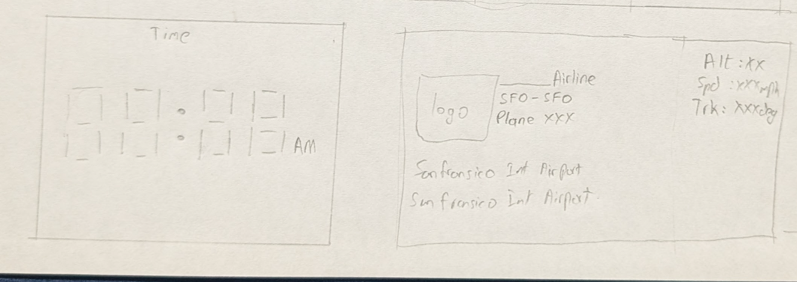
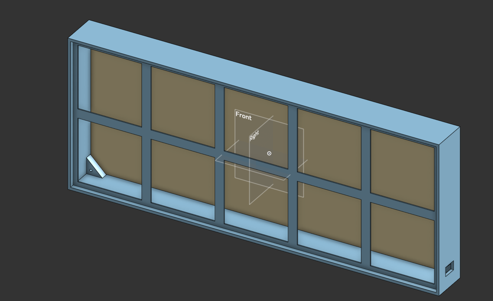
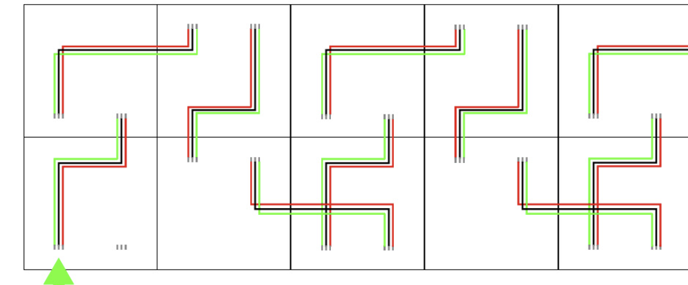

# Flight-Tracker-Clock

A wall-mounted LED matrix display that shows real-time aircraft flying near your location.  
FlightWall will use ADS-B data from OpenSky and enriched flight metadata from FlightAware AeroAPI to display aircraft position, route, airline, and aircraft type on a modular 16×16 LED matrix wall — while also functioning as a large ambient clock when no aircraft are nearby.

---

##  Hardware Design

### Front (LED Matrix Layout)

- 10× WS2812B 16×16 LED matrices
- Seamless tiled display area
---

### Back (Electronics & Mounting)

- ESP32 controller
- Power distribution bus
- Level shifter
- Wall mounting points
---
##  Wireing
The panels will be wiered in a snake pattern like showns in this image

All other electronics wiring diagram

##  Data Sources

FlightWall combines two aviation data sources:

### OpenSky Network
Provides live ADS-B state vectors:
- Latitude
- Longitude
- Altitude
- Heading
- ICAO24 identifier

Used for:
- Detecting aircraft within radius
- Real-time positioning on display

### FlightAware AeroAPI
Provides enriched metadata:
- Flight number
- Airline
- Origin / destination airports
- Aircraft type
- Airline name

Used for:
- Display info panel
- Airline identification
- Aircraft details

---

|Item                           |Quantity|Individual Price|Bulk Price|Link                                                                                                                                                                                                                                                                                                                                                                                                                                                                                                                |
|-------------------------------|--------|----------------|----------|--------------------------------------------------------------------------------------------------------------------------------------------------------------------------------------------------------------------------------------------------------------------------------------------------------------------------------------------------------------------------------------------------------------------------------------------------------------------------------------------------------------------|
|RGB Matrix                     |10      |7.21 per item   |56.85     |https://www.aliexpress.us/item/2255800358269772.html?spm=a2g0o.cart.0.0.b67938daC7qvao&mp=1&pdp_npi=6%40dis%21USD%21USD%20105.28%21USD%2056.85%21%21USD%2056.85%21%21%21%402103119c17717861824295998ef91b%2112000032067904146%21ct%21US%216564620185%21%212%210%21&_gl=1*10aplru*_gcl_au*MTA1MDMwNjU3NC4xNzcxMTcxMzM1*_ga*NDA5NjEzNjUxLjE3NzE2OTA2NzI.*_ga_VED1YSGNC7*czE3NzE3ODM0MjckbzIkZzEkdDE3NzE3ODY0NjgkajQ2JGwwJGgw&gatewayAdapt=glo2usa                                                                     |
|PSU                            |1       |16.99           |          |https://www.amazon.com/Universal-Regulated-Switching-Converter-Transformer/dp/B07PQT2Q7L/ref=sr_1_3?dib=eyJ2IjoiMSJ9.cEWptQECZPYG2UmZUYZKu27Der-60rKYmksJWPu2jfq-t_tjcURGmZPc6fqnC6qrFeLueRV8Q3iA0Yjme2BFhRX4uvcC89qr99GIQHK5FTtRDXZG35GoItHKqDTEt0kjfjwK8eRtw73qpNlFHG7D_wyzkllD-MdW4Dd7stjVi6wmBEZPdsW0PgQJNxiSliQ52wrsFaeYZM8a2uLaKulkyxIBMX6a8hWAsDA1ZcGQTts.sJkwYSu1jO9A_BELkSVmWfWshD8Z8wdUHfM-MuCyBxQ&dib_tag=se&keywords=5v%2B20a&qid=1771786531&sr=8-3&th=1                                                |
|3.3V - 5V voltage level shifter|1       |                |1.84      |https://www.aliexpress.us/item/3256806068872126.html?spm=a2g0o.detail.0.0.2210OMg5OMg5xa&mp=1&pdp_npi=6%40dis%21USD%21USD%201.84%21USD%201.84%21%21USD%201.84%21%21%21%402101e2b617717865813487690edf78%2112000036486126671%21ct%21US%216564620185%21%211%210%21&_gl=1*yn9aq9*_gcl_au*MTA1MDMwNjU3NC4xNzcxMTcxMzM1*_ga*NDA5NjEzNjUxLjE3NzE2OTA2NzI.*_ga_VED1YSGNC7*czE3NzE3ODM0MjckbzIkZzEkdDE3NzE3ODY1ODAkajYwJGwwJGgw&gatewayAdapt=glo2usa                                                                        |
|                               |        |                |          |                                                                                                                                                                                                                                                                                                                                                                                                                                                                                                                    |
|Items I already have           |        |                |          |                                                                                                                                                                                                                                                                                                                                                                                                                                                                                                                    |
|ESP-32                         |1       |9.99            |          |https://www.amazon.com/HiLetgo-ESP-WROOM-32-Development-Microcontroller-Integrated/dp/B0718T232Z/ref=sr_1_7?crid=QOLNQ7EQ7KFI&dib=eyJ2IjoiMSJ9.0mMutUw27FQh3oBplnQp1W-j79c1kFkqAhjtYy2WbRB2C73bCbQDPKPg6vtjYQ2cOyit-rw8Tk2oXiCEARMj8YkTzThMgD08OA8U0HiTIIDrUj0izC1sAf9nSEQ4hUUd0BiFGUJ6QAdGMjNa4B49RDU4hpBqhKw67Sz0LG8xFDa-NGdkMcTiNQAvY1tpgW-7mKXzXPP4ozJD4w6nTOzXvzy49iGQangh7_T-w2X1Vj0.TtOqHgXUQPfbHSQAi0XrPPqTQfGhT72rmnk0HYLESVU&dib_tag=se&keywords=esp32&qid=1771787487&sprefix=esp3%2Caps%2C231&sr=8-7&th=1|
|Filament                       |        |                |          |                                                                                                                                                                                                                                                                                                                                                                                                                                                                                                                    |
